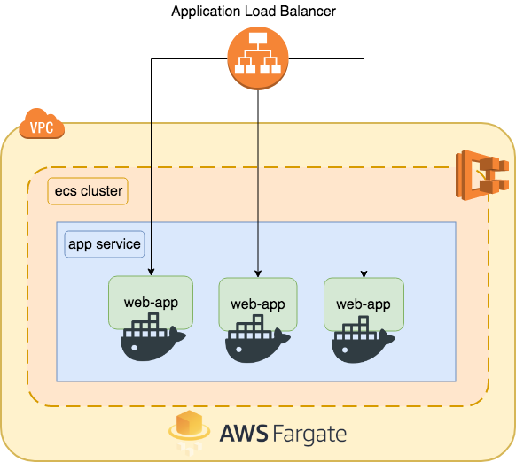
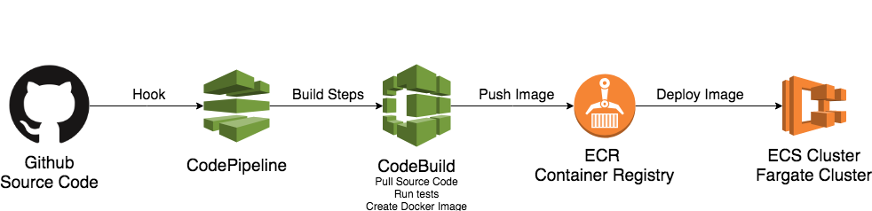

# Teste Ciclic - Rafael Navas Bielawski
Criação de uma stack para deploy de aplicação node (api) utilizando ECS, ECR, CodePipeline e Git com Terraform

## Arquitetura 



## Deploy Pipeline




## Variáveis a alterar

Aquivo `variables.tf` conta Github, Repo e proprietário, Load Balancer portas e preferências do cluster. 

```hcl
# Customize the Cluster Name
variable "cluster_name" {
  description = "ECS Cluster Name"
  default     = "ciclic"
}

# Customize your ECR Registry Name
variable "app_repository_name" {
  description = "ECR Repository Name"
  default     = "ciclic"
}

###### APPLICATION OPTIONS  ######
variable "container_name" {
  description = "Container app name"
  default     = "micro-api"
}
```

Variáveis do repositório Github da aplicação. 

```hcl
# Github Repository Owner
variable "git_repository_owner" {
  description = "Github Repository Owner"
  default     = "rafabiela"
}

# Github Repository Project Name
variable "git_repository_name" {
  description = "Project name on Github"
  default     = "teste-ciclic-app"
}

# Default Branch
variable "git_repository_branch" {
  description = "Github Project Branch"
  default     = "master"
}
```

## Configuração dos steps de build do app

 `modules/pipeline/templates/buildspec.yml`. 


## Deploy

### Github Access Token

Necessário TOKEN da conta do Github para hook e monitoração da branch 

```bash
export GITHUB_TOKEN=YOUR_TOKEN
``` 

## Teste da aplicação

```bash
curl < url gerada no alb >/ -i
```
ex: `curl ciclic-alb-1358103402.us-east-1.elb.amazonaws.com/ -i`


#### Referencias que utilizei

* [Easy deploy your Docker applications to AWS using ECS and Fargate](https://thecode.pub/easy-deploy-your-docker-applications-to-aws-using-ecs-and-fargate-a988a1cc842f)

* [ECS Terraform - By alex](https://github.com/alex/ecs-terraform)

* [Terraform-ECS by arminc](https://github.com/arminc/terraform-ecs)
